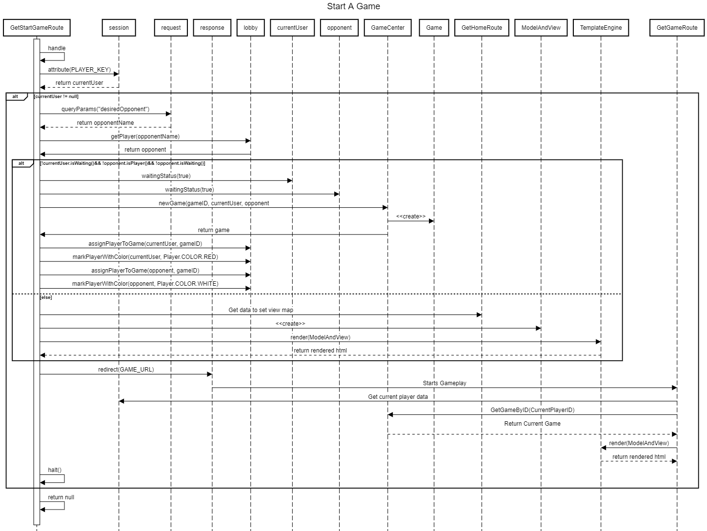
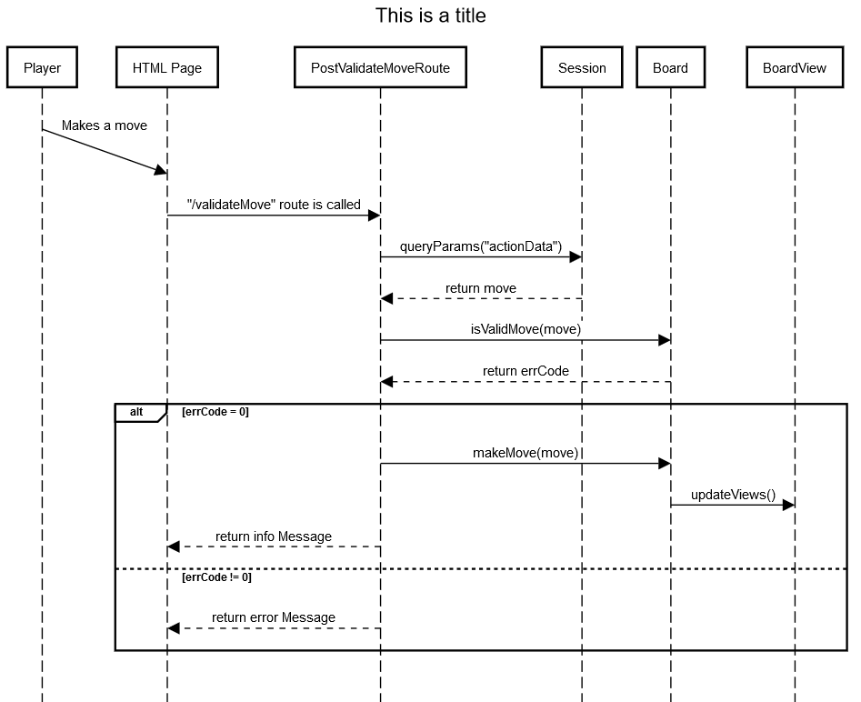
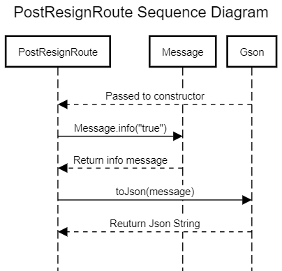
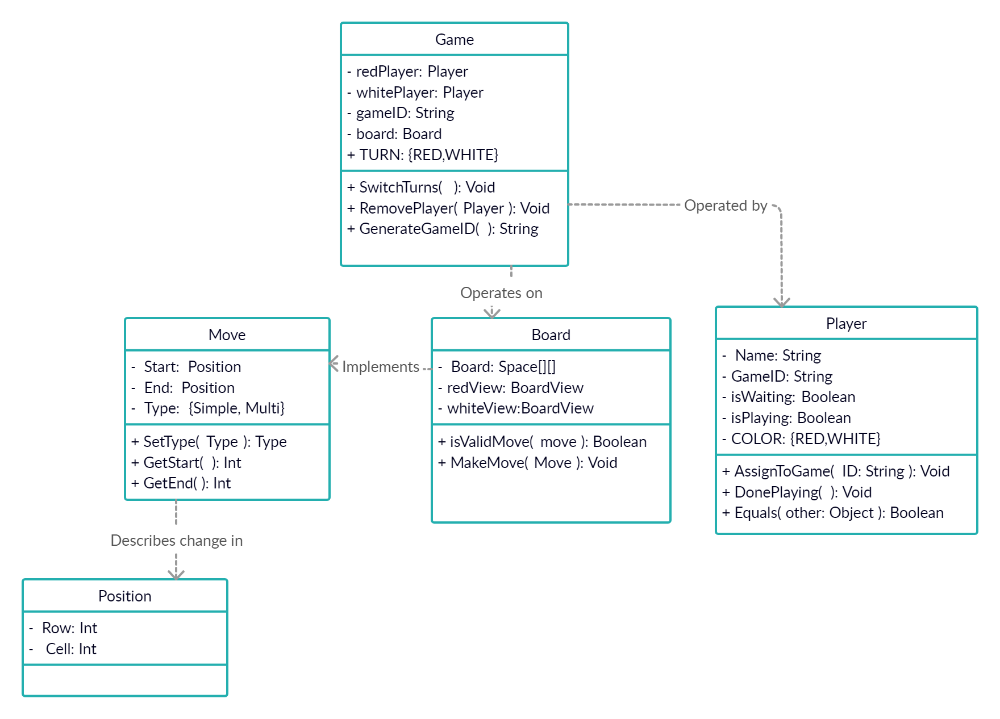

 ---
geometry: margin=1in
---
# PROJECT Design Documentation

> _The following template provides the headings for your Design
> Documentation.  As you edit each section make sure you remove these
> commentary 'blockquotes'; the lines that start with a > character
> and appear in the generated PDF in italics._

## Team Information
* Team name: Team 05a
* Team members
  * Austin Cepalia
  * Jack Thomas
  * Ferdous Zaman
  * Promise Omiponle
  * Anthony DelPrincipe

## Executive Summary

Our project models a game of checkers played within one's browser. 
A user is able to open a tab from their local host on their browser, and the
sign in page will appear. They are able to see the number of players online,
or sign in with an appropriate user name, which will take them to the
HOME screen. From here, they are able to see other players online, and either
sign out or start a game with one of them. The game will be a GUI of
a standard checkers game, which will pop up for both players involved.
The game plays as a regular game of checkers with standard American rules,
which will end with a win/lose or via resigning.

### Purpose
The purpose of this project is to not only develop a working model of a checkers
game to be played in one's browser, but also to hone the project member's 
knowledge not only of HTTP requests and responses via the Spark framework,
but more importantly to practice good code design and learn about how to effectively
design a product.

### Glossary and Acronyms
> _Provide a table of terms and acronyms._

| Term | Definition |
|------|------------|
| VO | Value Object |

## Requirements

This section describes the features of the application.

The application should provide an online multiplayer checkers game.
Every player must sign in before playing, and must be able to sign out afterwards.
Checkers games must take place between two people and follow American Standard Rules.
Either Player must be able to resign any time to end the game.

### Definition of MVP
A complete implementation of the American Standard Rules of checkers
in a web application that allows users to sign-in, select opponents, and play
checkers.

### MVP Features
The MVP will include sign-in/sign-out capability, piece movement, 
piece jumping, kinging, and options for resignation.

### Roadmap of Enhancements
The first enhancement to be added will be a replay mode, allowing users to 
rewatch their games to review strategies. The second feature will be a spectator mode, 
allowing users to watch other games in progress.

## Application Domain

This section describes the application domain.

This domain model shows the high-level interactions among the various aspects of
our project. The player signs in to the website with a given account (username)
and is able to play a game of Checkers via said account. The checkers game is
played on a board, composed of squares that have pieces on them. The player is able
to make a move, which moves the checker pieces from square to square on the board in
alternating turns. This move can be a jump or multijump, where multiple pieces are
taken.

## Architecture and Design

This section describes the application architecture.

### Summary

The following Tiers/Layers model shows a high-level view of the webapp's architecture.

As a web application, the user interacts with the system using a
browser.  The client-side of the UI is composed of HTML pages with
some minimal CSS for styling the page.  There is also some JavaScript
that has been provided to the team by the architect.

The server-side tiers include the UI Tier that is composed of UI Controllers and Views.
Controllers are built using the Spark framework and View are built using the FreeMarker framework.  The Application and Model tiers are built using plain-old Java objects (POJOs).

Details of the components within these tiers are supplied below.

### Overview of User Interface

This section describes the web interface flow; this is how the user views and interacts
with the WebCheckers application.

When the user logs onto our webapp, the home page is gotten and rendered. At first,
this will only have a sign in link, which when clicked renders the sign in page.
The user is allowed to input a name to play with, but will be redirected back
to the sign in page if it is invalid. if it is valid, they will be redirected
back to the home page, this time able to see a list of online players. Clicking on
a users name won't do anything if the other user is already in a game, but if they
are available to play with, the game view will be rendered. In this game, they are
allowed to move their piece which will be validated, and if it is valid, allowed to
submit ti and wait for it to be their turn again.

### UI Tier
The UI tier is the largest tier by number of classes, holding
GetHomeRoute, GetGameRoute, GetSigninRoute, GetStartGameRoute,
PostBackupMoveRoute, PostCheckTurnRoute, PostResignRoute, PostSigninRoute,
PostSubmitTurnRoute, and PostValidateMoveRoute.

GetHomeRoute is responsible for building the home page, as well as handling 
GameOver state modifications. From the home page, the Sign-In page can be
accessed. The GetSigninRoute fetches the sign-in form while PostSigninRoute
sends it to the PlayerLobby to be evaluated. 

Once a player is logged in, they can start a game from the home route.
This calls GetStartGameRoute, which builds the initial game
state before passing the users to GetGameRoute to manage playing the game itself.

The above Sequence diagram shows the start game process in greater detail.
During gameplay, the various buttons on the control panel also make use of HTTP routes,
and are thus featured in this tier. PostBackupMoveRoute sends a request in the form of a message object
to undo a move. PostCheckTurnRoute verifies the current turn to minimize confusion.
Like most of the in-game HTTP requests, it uses Json Message objects to do this.
PostValidateMoveRoute is called whenever a piece is moved to check whether the move follows
the established rules. The details of which can be seen below.

PostResignRoute is called when either player resigns. It sends a message object
to the JavaScript client, which then redirects the player to the home page. The precise sequence diagram
for this action is displayed below.

Lastly, PostSubmitTurnRoute signals to the JavaScript client and to the model tier
components that the current turn is over and that the other player can now take theirs.

### Application Tier
The application tier is the simplest tier, as much of the implementation 
is handled either on the client-side or in other tiers. There are two classes in the application tier, 
PlayerLobby and GameCenter. GameCenter holds all active games and provides 
functionality to start and access those games. PlayerLobby performs a similar task with active
Players by holding a list of all signed in players and managing game placement.

### Model Tier
The model tier holds the server-side implementation of the game.
This tier dictates the behavior of the UI controllers relatijng to
playing the game itself. The tier is made up of the Board,
Game, Move, Player, and Position classes.

The game stores a Board object and two Player objects and is responsible
for player-board interaction. The board itself holds some UI information relating 
to views for different players. Board also evaluates and controls Moves.
Move class objects hold starting and ending Position class objects, which refer to
spaces on the Board.

### Design Improvements
> _Discuss design improvements that you would make if the project were
> to continue. These improvement should be based on your direct
> analysis of where there are problems in the code base which could be
> addressed with design changes, and describe those suggested design
> improvements. After completion of the Code metrics exercise, you
> will also discuss the resutling metric measurements.  Indicate the
> hot spots the metrics identified in your code base, and your
> suggested design improvements to address those hot spots._

## Testing
> _This section will provide information about the testing performed
> and the results of the testing._

### Acceptance Testing
> _Report on the number of user stories that have passed all their
> acceptance criteria tests, the number that have some acceptance
> criteria tests failing, and the number of user stories that
> have not had any testing yet. Highlight the issues found during
> acceptance testing and if there are any concerns._

### Unit Testing and Code Coverage
> _Discuss your unit testing strategy. Report on the code coverage
> achieved from unit testing of the code base. Discuss the team's
> coverage targets, why you selected those values, and how well your
> code coverage met your targets. If there are any anomalies, discuss
> those._
