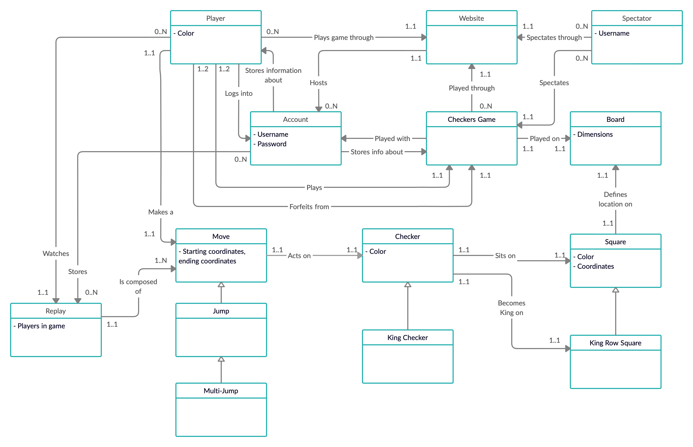
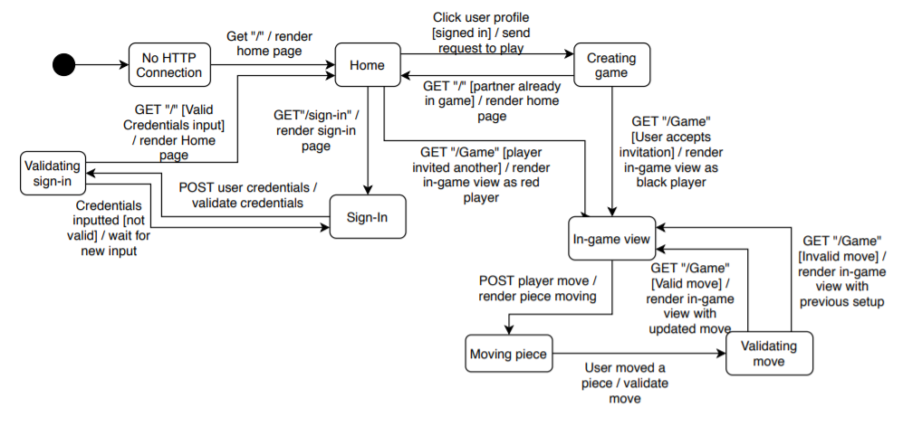

 ---
geometry: margin=1in
---
# PROJECT Design Documentation

> _The following template provides the headings for your Design
> Documentation.  As you edit each section make sure you remove these
> commentary 'blockquotes'; the lines that start with a > character
> and appear in the generated PDF in italics._

## Team Information
* Team name: Team 05a
* Team members
  * Austin Cepalia
  * Jack Thomas
  * Ferdous Zaman
  * Promise Omiponle
  * Anthony DelPrincipe

## Executive Summary

Our project models a game of checkers played within one's browser. 
A user is able to open a tab from their local host on their browser, and the
sign in page will appear. They are able to see the number of players online,
or sign in with an appropriate user name, which will take them to the
HOME screen. From here, they are able to see other players online, and either
sign out or start a game with one of them. The game will be a GUI of
a standard checkers game, which will pop up for both players involved.
The game plays as a regular game of checkers with standard American rules,
which will end with a win/lose or via resigning.

### Purpose
The purpose of this project is to not only develop a working model of a checkers
game to be played in one's browser, but also to hone the project member's 
knowledge not only of HTTP requests and responses via the Spark framework,
but more importantly to practice good code design and learn about how to effectively
design a product.

### Glossary and Acronyms
> _Provide a table of terms and acronyms._

| Term | Definition |
|------|------------|
| VO | Value Object |

## Requirements

This section describes the features of the application.

> _In this section you do not need to be exhaustive and list every
> story.  Focus on top-level features from the Vision document and
> maybe Epics and critical Stories._

### Definition of MVP
> _Provide a simple description of the Minimum Viable Product._

### MVP Features
> _Provide a list of top-level Epics and/or Stories of the MVP._

### Roadmap of Enhancements
> _Provide a list of top-level features in the order you plan to consider them._

## Application Domain

This section describes the application domain.

This domain model shows the high-level interactions among the various aspects of
our project. The player signs in to the website with a given account (username)
and is able to play a game of Checkers via said account. The checkers game is
played on a board, composed of squares that have pieces on them. The player is able
to make a move, which moves the checker pieces from square to square on the board in
alternating turns. This move can be a jump or multijump, where multiple pieces are
taken.

## Architecture and Design

This section describes the application architecture.

### Summary

The following Tiers/Layers model shows a high-level view of the webapp's architecture.

As a web application, the user interacts with the system using a
browser.  The client-side of the UI is composed of HTML pages with
some minimal CSS for styling the page.  There is also some JavaScript
that has been provided to the team by the architect.

The server-side tiers include the UI Tier that is composed of UI Controllers and Views.
Controllers are built using the Spark framework and View are built using the FreeMarker framework.  The Application and Model tiers are built using plain-old Java objects (POJOs).

Details of the components within these tiers are supplied below.

### Overview of User Interface

This section describes the web interface flow; this is how the user views and interacts
with the WebCheckers application.

When the user logs onto our webapp, the home page is gotten and rendered. At first,
this will only have a sign in link, which when clicked renders the sign in page.
The user is allowed to input a name to play with, but will be redirected back
to the sign in page if it is invalid. if it is valid, they will be redirected
back to the home page, this time able to see a list of online players. Clicking on
a users name won't do anything if the other user is already in a game, but if they
are available to play with, the game view will be rendered. In this game, they are
allowed to move their piece which will be validated, and if it is valid, allowed to
submit ti and wait for it to be their turn again.

### UI Tier
> _Provide a summary of the Server-side UI tier of your architecture.
> Describe the types of components in the tier and describe their
> responsibilities.  This should be a narrative description, i.e. it has
> a flow or "story line" that the reader can follow._

> _At appropriate places as part of this narrative provide one or more
> static models (UML class structure or object diagrams) with some
> details such as critical attributes and methods._

> _You must also provide any dynamic models, such as statechart and
> sequence diagrams, as is relevant to a particular aspect of the design
> that you are describing.  For example, in WebCheckers you might create
> a sequence diagram of the `POST /validateMove` HTTP request processing
> or you might show a statechart diagram if the Game component uses a
> state machine to manage the game._

> _If a dynamic model, such as a statechart describes a feature that is
> not mostly in this tier and cuts across multiple tiers, you can
> consider placing the narrative description of that feature in a
> separate section for describing significant features. Place this after
> you describe the design of the three tiers._

### Application Tier
> _Provide a summary of the Application tier of your architecture. This
> section will follow the same instructions that are given for the UI
> Tier above._

### Model Tier
> _Provide a summary of the Application tier of your architecture. This
> section will follow the same instructions that are given for the UI
> Tier above._

### Design Improvements
> _Discuss design improvements that you would make if the project were
> to continue. These improvement should be based on your direct
> analysis of where there are problems in the code base which could be
> addressed with design changes, and describe those suggested design
> improvements. After completion of the Code metrics exercise, you
> will also discuss the resutling metric measurements.  Indicate the
> hot spots the metrics identified in your code base, and your
> suggested design improvements to address those hot spots._

## Testing
> _This section will provide information about the testing performed
> and the results of the testing._

### Acceptance Testing
> _Report on the number of user stories that have passed all their
> acceptance criteria tests, the number that have some acceptance
> criteria tests failing, and the number of user stories that
> have not had any testing yet. Highlight the issues found during
> acceptance testing and if there are any concerns._

### Unit Testing and Code Coverage
> _Discuss your unit testing strategy. Report on the code coverage
> achieved from unit testing of the code base. Discuss the team's
> coverage targets, why you selected those values, and how well your
> code coverage met your targets. If there are any anomalies, discuss
> those._
